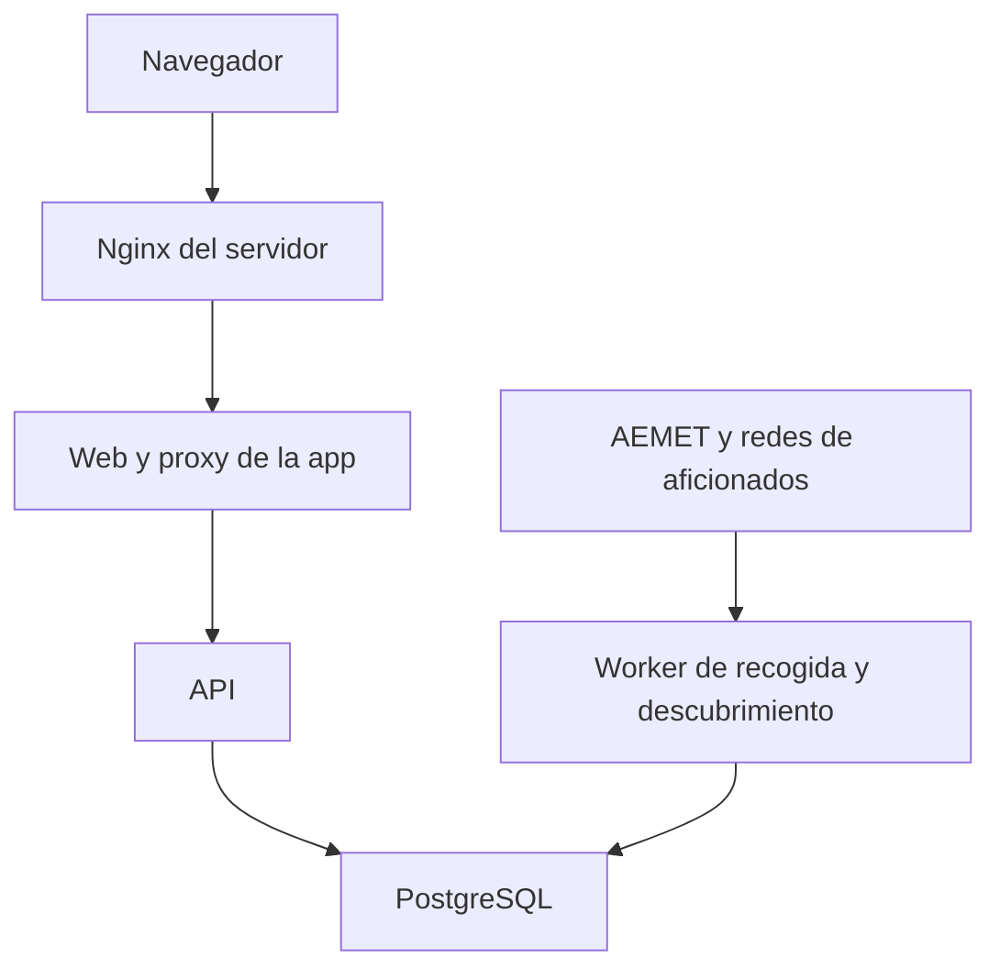

# Resumen global de Meteocentro

Este documento define la aplicación meteorológica que se desarrollará con Codex. Reúne el alcance funcional, la arquitectura, las reglas de datos y el plan de entrega. El objetivo es consultar en un mapa las estaciones de Madrid, Ávila, Segovia y Guadalajara y explorar sus históricos con una experiencia inspirada en Suremet.

La propuesta utiliza una base de datos propia y un proceso de recogida permanente. Esto permite consultar datos ya almacenados aunque un proveedor falle, construir series desde el primer día y excluir estaciones problemáticas sin que vuelvan a aparecer automáticamente.

**Estado a 9 de septiembre de 2026:** especificación preparada; aplicación e integraciones reales pendientes de desarrollo. Las capacidades documentadas de una API no equivalen a acceso probado con las credenciales del proyecto. Los enlaces de evidencia están en [FUENTES.md](FUENTES.md).

**Actualización de alcance tras revisar el coste:** el usuario no tiene clave Wunderground y prefiere prescindir de esa red si supone un coste alto. La primera versión propuesta usará AEMET y Meteoclimatic. Wunderground queda aplazado como ampliación opcional; su ausencia no bloquea ninguna fase ni el cierre de esta versión. Ver [coste y acceso](COSTE_Y_ACCESO_DATOS.md).

## Alcance geográfico y fuentes

| Provincia | Código provincial | Inclusión |
| --- | --- | --- |
| Madrid | 28 | Toda la provincia |
| Ávila | 05 | Toda la provincia |
| Segovia | 40 | Toda la provincia |
| Guadalajara | 19 | Toda la provincia |

Se incluyen estaciones situadas dentro de los límites provinciales, tanto de capitales y municipios como de áreas rurales y de montaña. La selección usa coordenadas y polígonos provinciales versionados; no una lista manual de ciudades ni solo un rectángulo que incluya provincias vecinas. Si faltan coordenadas verificables, la estación queda pendiente de revisión.

Fuentes de la primera versión: AEMET como red oficial y Meteoclimatic como red de aficionados. Weather Underground se conserva en el diseño como ampliación posible. La procedencia será visible en cada estación y cada serie. No se presupone que una estación oficial, aficionada o auditada sea infalible.

## Experiencia inspirada en Suremet

La revisión de Suremet confirmó un mapa topográfico con marcadores numéricos coloreados, controles de variables, contadores de estaciones, extremos de la red, tablas diarias y fichas con periodos rápidos de consulta. Sus elementos sirven como referencia funcional; el diseño y los componentes de Meteocentro serán propios [S1–S5].

| Elemento | Comportamiento previsto | Fase |
| --- | --- | --- |
| Mapa principal | Ocupa la mayor parte de la pantalla; relieve legible, zoom, pantalla completa y cambio de fondo | 4 |
| Marcadores | Número y color según la variable; nombre, fuente, hora y acceso a ficha al pulsar | 4 |
| Variables del mapa | Temperatura actual, mínima y máxima; humedad; viento y racha; precipitación del periodo e intensidad disponible | 4 y 5 |
| Filtros y búsqueda | Provincia, red, variable, estado y estación por nombre, municipio o ID | 4 |
| Resumen de la red | Registradas, con datos recientes y desactualizadas; extremos entre estaciones elegibles | 4 y 5 |
| Tabla de estaciones | Valores ordenables, altitud, fuente y última observación; selección sincronizada con el mapa | 4 |
| Ficha de estación | Valores, extremos, ubicación, altitud y metadatos disponibles; enlaces a su origen | 4 |
| Gráficos de estación | 24 h, 48 h, 72 h, 7 días, 14 días y fechas personalizadas | 5 |
| Históricos y diarios | Series, tablas, resúmenes mensuales y anuales y descarga CSV cuando se permita | 5 |
| Efemérides | Extremos del archivo disponible, siempre acompañados de cobertura y fechas | 5 |
| Administración | Panel privado para excluir, restaurar y revisar estaciones y fuentes | 6 |
| Descubrimiento | Actualización periódica de catálogos y búsqueda manual desde el panel | 3 y 6 |

La navegación principal será **Mapa**, **Estaciones**, **Datos diarios** e **Históricos**; la gestión estará en un acceso separado. En móvil, la ficha se abrirá en un panel inferior y los filtros serán plegables. El cambio de variable no debe reiniciar la posición del mapa. Las leyendas incluyen unidad, periodo y significado del color; el color no es la única forma de leer un dato.

Se conserva el carácter de portal meteorológico de Suremet, con información abundante y acceso rápido. Se propone una cabecera compacta con tonos azul y violeta, fondo claro, mapa topográfico y tablas legibles. No se reutilizan su logo, sus gráficos ni su código.

Las secciones de asociación, altas de socios y repositorio científico son propias de la organización de Suremet y no forman parte de este producto. Pronósticos, radar, alertas, webcams, aplicación nativa y widget público quedan como ampliaciones a valorar, sin retrasar el mapa ni los históricos solicitados.

## Qué significa eliminar una estación

La acción visible será **Eliminar de la app**. Su implementación será una exclusión persistente, con motivo opcional, fecha y usuario. Se conserva la identidad en una lista de exclusión para impedir que la búsqueda automática vuelva a darla de alta.

Al excluirla:

1. Desaparece del mapa, tablas, extremos, buscador público, gráficos y exportaciones, también si se conoce su URL.
2. Se detienen los trabajos individuales de recogida e importación asociados. Si la red se descarga en un único lote, se descartan sus registros antes de guardarlos.
3. Se conserva el histórico ya almacenado para revisión privada y posible restauración, dentro de las condiciones de conservación del proveedor.
4. Un trabajo que estaba en curso vuelve a comprobar la exclusión antes de escribir o publicar resultados.
5. Una nueva detección o un reinicio no la reactiva. Solo una restauración explícita en el panel lo hace.

La exclusión no elimina la estación de AEMET, Meteoclimatic o Wunderground. El borrado físico de históricos no se incluye en esta primera versión: no es necesario para dejar de mostrar datos erróneos y dificultaría deshacer un error.

Si una estación física emite a dos redes, se guardan ambos identificadores bajo una identidad común cuando se haya verificado la coincidencia. La exclusión de esa estación afecta a sus fuentes vinculadas. También se podrá desactivar un único origen si el problema solo está en una de las redes. Una coincidencia de nombre o cercanía solo genera una sugerencia de duplicado; no fusiona estaciones automáticamente.

## Actualización de datos y descubrimiento

**Sí, habrá un proceso de fondo permanente.** Vivirá en su propio contenedor y no dependerá del navegador, de una petición web ni de una sesión SSH abierta. Un único worker programará y ejecutará trabajos; PostgreSQL conservará el estado, los puntos de reanudación y las exclusiones.

| Trabajo | Frecuencia inicial propuesta | Condición |
| --- | --- | --- |
| Observaciones AEMET | Cada 15 minutos, preferentemente por lote | Ajustable a publicación y cuota; consultar más no aumenta la resolución original |
| Observaciones Meteoclimatic | Cada 10 minutos por ámbito | Ajustar al feed, sus indicaciones y las condiciones de acceso |
| Observaciones Wunderground si se reactiva la ampliación | Cada 10–15 minutos por estación habilitada | Desactivadas en la primera versión |
| Catálogo AEMET y Meteoclimatic | Una vez al día | Diferencias con el catálogo anterior, sin eliminar por una ausencia temporal |
| Descubrimiento Wunderground si se reactiva la ampliación | Una vez a la semana | Desactivado en la primera versión; no garantiza cobertura exhaustiva |
| Agregados históricos | Incrementales cada hora y revisión nocturna | Recalcular periodos afectados por observaciones tardías o corregidas |
| Importación de históricos | En segundo plano con prioridad baja | Reanudable, por ventanas y con límite de llamadas |

Estas frecuencias son parámetros de diseño, no compromisos de los proveedores. Cada integración registra su cadencia real y la edad de la observación. El frontend puede consultar nuestra API cada 60 segundos sin generar llamadas adicionales a las redes externas.

El descubrimiento propone o incorpora estaciones con ID estable, coordenadas válidas, provincia admitida y acceso permitido. Los casos dudosos van al panel de revisión. La automatización evita tener que mantener a mano toda la lista. Si en el futuro se incorpora Wunderground, su búsqueda de proximidad no garantiza encontrar todas sus estaciones: devuelve hasta diez resultados por consulta [S12]. Habrá alta manual mediante ID del proveedor como complemento.

## Viabilidad de las fuentes

| Fuente | Vía localizada | Lo que se debe comprobar en fase 0 |
| --- | --- | --- |
| AEMET | OpenData con observaciones, inventario climatológico y productos históricos | Clave, cuotas, metadatos, estaciones que existen en cada producto y antigüedad disponible |
| Meteoclimatic | Feeds XML y RSS documentados; archivo de resúmenes diarios | Endpoints efectivos, coordenadas, horario, términos de reutilización y acceso automatizado al histórico |
| Wunderground aplazado | APIs PWS de The Weather Company para datos actuales, históricos y proximidad | Solo al reactivar la ampliación: acceso, conservación, redistribución y cuota suficiente |

El inventario climatológico de AEMET no se tratará como catálogo completo de estaciones actuales. Se combinarán los IDs observados en el producto de tiempo actual con el inventario de históricos, preservando las capacidades de cada estación [S6–S8].

Meteoclimatic documenta un archivo diario de extremos y precipitación; eso no permite reconstruir curvas intradiarias antiguas. La documentación de sus condiciones incluye restricciones que hay que aclarar para el uso concreto antes de publicar datos transformados [S9–S11].

Wunderground queda fuera del presupuesto inicial. Una web visible o una suscripción sin anuncios no acreditan permisos para una API de agregación. La revisión de precios y claves se recoge en el documento de coste; si se reactiva, habrá que comprobar el acceso y las condiciones concretas [S12–S15, S26–S28].

## Arquitectura propuesta

| Componente | Tecnología propuesta | Responsabilidad |
| --- | --- | --- |
| Interfaz | React, TypeScript y Vite | Mapa, filtros, fichas, tablas y administración |
| Mapa | MapLibre GL JS | Capas, marcadores y representación de estaciones |
| Gráficos | Apache ECharts | Series temporales y resúmenes con huecos visibles |
| API | Python y FastAPI | Consulta de datos y autorización de operaciones |
| Datos | PostgreSQL, SQLAlchemy y Alembic | Catálogo, observaciones, agregados y migraciones |
| Worker | Python, mismo paquete de dominio que la API | Adaptadores, planificación, límites y recuperación |
| Despliegue | Podman y Quadlet/systemd | Ciclo de vida de los cuatro contenedores |
| Entrada HTTPS | Nginx existente en el host | Dominio y certificados, proxy hacia la app |

La elección es una propuesta para esta aplicación. Se evita exigir Kubernetes, Redis o una base de series temporales adicional para la primera versión. Las versiones exactas se fijarán al desarrollar; este plan no presupone qué versión de Podman está instalada en el servidor remoto.

Los cuatro contenedores son `web`, `api`, `worker` y `db`. Solo `web` publica un puerto local del host. La API y la base de datos quedan en la red de contenedores. El frontend llama a `/api` del mismo dominio; las claves de proveedores solo están en los procesos del servidor que las necesitan. La cartografía base es una dependencia separada, configurable y con atribución y condiciones de uso propias [S16–S22].

## Modelo y reglas de datos

| Entidad | Contenido mínimo |
| --- | --- |
| `providers` | Capacidades, estado operativo, referencias de condiciones, frecuencia y presupuesto de llamadas |
| `stations` | UUID interno, nombre, provincia, ubicación canónica y estado de moderación |
| `station_sources` | Proveedor, ID externo, estación interna, coordenadas de origen y capacidades |
| `station_location_history` | Cambios de emplazamiento y fecha de vigencia para interpretar series |
| `observations` | Fuente, producto, hora real, métricas, periodos, calidad y versión del normalizador |
| `latest_observations` | Último valor utilizable por fuente y métrica; actualización monotónica |
| `daily_summaries` | Resumen del proveedor o cálculo propio, intervalo, cobertura y método |
| `hourly_aggregates` | Agregados locales para consultar series largas sin descargar todo el detalle |
| `exclusions` y `audit_events` | Exclusiones de estaciones u orígenes y registro de cambios |
| `jobs` e `ingestion_runs` | Programación, resultado, arrendamiento del trabajo y puntos de reanudación |
| `admin_users` y `sessions` | Acceso privado, sesiones revocables y trazabilidad |

Las observaciones se identifican de forma única por fuente, producto, instante y periodo. La ingestión es idempotente: repetir una respuesta no crea duplicados. Si el proveedor corrige un registro, se conserva la trazabilidad y se recalculan los agregados afectados.

Los instantes se guardan en UTC con zona horaria y se presentan por defecto en `Europe/Madrid`. Cada estadístico diario conserva su ventana real: no se etiqueta un resumen UTC o climatológico como si cubriera necesariamente el día civil de Madrid. La API expone inicio, fin, zona o convención del periodo y método de cálculo.

Unidades canónicas: °C, %, hPa, m/s, grados y mm; la interfaz muestra viento en km/h. La presión incluye su tipo. La lluvia distingue incremento de intervalo, contador diario, total móvil y tasa en mm/h. Se consideran reinicios del contador, medianoche, huecos y cambios de horario. El dato ausente permanece nulo.

Se conserva la calidad del proveedor por separado de nuestras reglas de plausibilidad. Los datos imposibles pueden quedar no utilizables; un valor extremo plausible solo se señala para revisión. Se mantienen los datos originales necesarios para depurar, dentro de su permiso y retención. La exclusión manual de la estación sigue siendo la decisión del administrador.

## Históricos y crecimiento

Desde la puesta en marcha se construye un archivo propio con la resolución publicada por cada fuente. El sistema no convierte una observación horaria en medidas de cinco minutos. Los datos anteriores se importan cuando exista una vía autorizada; si no existe, la ficha informa de la primera fecha disponible.

Las consultas largas usarán agregados, conservarán mínimos y máximos y mostrarán los huecos. Los resúmenes oficiales y los calculados localmente tendrán etiquetas diferentes. Los cambios de emplazamiento y de fuente deben verse en la serie.

Ejemplo de dimensionamiento, no inventario real: 1.000 fuentes publicando una fila nueva cada 10 minutos producirían unos 144.000 registros diarios y 52,6 millones al año. El número de filas depende de la cadencia nativa y de las fuentes duplicadas. No se estiman GB sin medir filas, índices y retención sobre datos reales.

Se propone conservar el detalle durante 24 meses si las condiciones lo permiten, y los agregados mientras sean útiles y esté autorizado. Antes de activar una purga se medirá el almacenamiento y se revisará la política; hasta entonces, la purga destructiva queda desactivada. El esquema permitirá particiones mensuales, con pruebas de índices y mantenimiento en fase 5.

## Acceso y operación

La aplicación tendrá un único administrador inicialmente, sin registro abierto. Se prepara lectura sin sesión como modalidad del producto y gestión siempre autenticada; el primer despliegue se mantiene privado hasta decidir la exposición pública y comprobar los permisos de las fuentes. El modo privado se aplica también a API y exportaciones.

El despliegue seguirá el flujo conocido de Podman, Quadlet/systemd y Nginx mediante `ssh remote`. Se propone Podman rootless, sujeto a la comprobación del host. Compose puede servir para desarrollo. Se mantendrán datos y secretos fuera del checkout y se usarán imágenes con versiones inmutables.

La operación incluye estado de fuentes, retraso de datos, registro de fallos y trabajos, copias de PostgreSQL, copia externa y restauración ensayada. Un worker vivo sin observaciones nuevas debe producir un estado degradado; una API accesible no prueba que la recogida funcione.

## Entrega y criterios de éxito

Las ocho fases están enlazadas en [README.md](../README.md). La fase 2 ya permite empezar a almacenar datos; las fases 4 y 5 construyen la experiencia principal; la fase 6 añade el control solicitado; la fase 7 deja una instalación operable.

La primera versión estará completa cuando el mapa y los históricos funcionen con AEMET y Meteoclimatic, ambas hayan pasado las pruebas reales de acceso e ingestión, y se demuestre que una exclusión sobrevive a un descubrimiento, a un trabajo en curso y a un reinicio. Si alguna de esas dos redes no está verificada, se indicará que la entrega es parcial. Wunderground figura como ampliación aplazada y no forma parte de este criterio de cierre.

Quedan por concretar la clave AEMET, las condiciones de uso de los productos de Meteoclimatic, el dominio final, la exposición pública y la antigüedad que se desea importar. El acceso Wunderground se revisará solo si se decide incorporar esa ampliación. Las propuestas y la forma de resolver estas decisiones figuran en [DECISIONES.md](DECISIONES.md).
